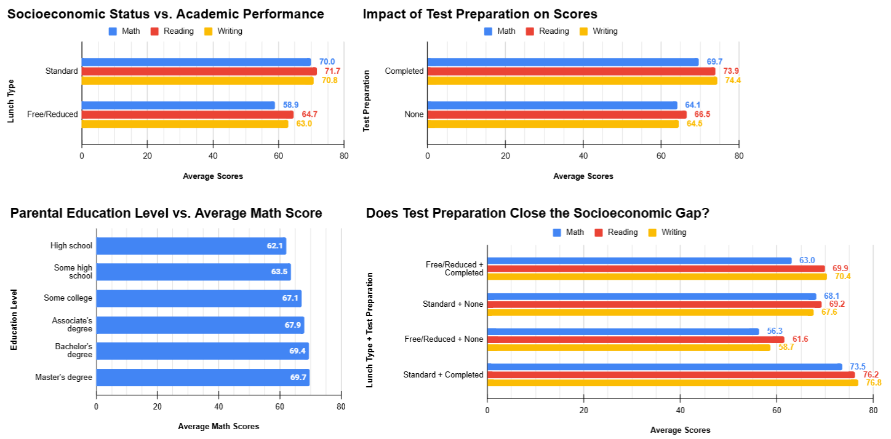

# Student Performance Analysis 

## Overview
An exploratory data analysis of 1,000 students' exam scores across maths, reading, and writing. The goal of the analysis is to identify the key factors that influence academic performance, with implications for school resource allocation. 

## Tools Used
- **SQL (SQLiteOnline)**: Data querying and aggregation
- **Google Sheets**: Dashboard and visualisation

## Dataset
Students Performance in Exams (Kaggle)

https://www.kaggle.com/datasets/spscientist/students-performance-in-exams

1,000 rows, 8 columns 

## Key Findings 
**1. Socioeconomic status (as measured by lunch type) is the strongest predictor of academic performance across all subjects.**

Lunch type emerged as the most influential variable in predicting student outcomes, serving as a strong proxy for socioeconomic status. Students receiving standard lunch outperformed peers on free or reduced lunch by **11.1 points in maths, 7.0 points in reading, and 7.8 points in writing**. This suggests that access to greater financial resources may significantly shape academic success. The particularly large gap in mathematics may indicate disparities in access to enrichment opportunities, tutoring, or home support systems that disproportionately benefit higher-income students.

**2. Test preparation significantly improves student test scores, with strongest effects seen in writing and reading.**

Participation in test preparation was associated with notable score increases across all subjects. Students who completed the course scored an average of **9.9 points higher in writing, 7.4 points higher in reading, and 5.6 points higher in maths** compared to those who did not. The strongest gains in writing suggest that the course may place heavier emphasis on essay structure, written communication, and literacy-focused strategies rather than quantitative reasoning. While test preparation clearly enhances performance, its uneven impact across subjects indicates that curriclum design may be more optimised for language-based assessments than for maths mastery. 

**3. Higher parental education levels are positively associated with stronger student performance, but the advantage plateaus at the highest levels.**

Parental education demonstrated a clear upward relationship with student achievement. Students whose parents held a master’s degree achieved the highest average scores, outperforming students whose parents completed only high school by **13.3 points in writing, 10.7 points in reading, and 7.6 points in maths**. This supports the idea that parental educational attainment may contribute to stronger academic environments, expectations, and support systems at home. However, the relatively small difference between students with parents holding bachelor’s degrees versus master’s degrees suggests diminishing returns at the top of the educational hierarchy. In other words, the “education ladder” appears real, but academic advantages begin to level off once parents reach higher education thresholds.

**4. Test preparation helps narrow socioeconomic disparities, but does not fully eliminate them.**

Although test preparation improves outcomes for disadvantaged students, it only partially closes the socioeconomic achievement gap. Students on free or reduced lunch who completed test preparation still scored below standard lunch students who received no preparation in both maths and reading. Writing was the exception, where prepared lower-income students were able to match or exceed their more affluent peers. This pattern suggests that while the intervention courses can be effective, they may currently be better designed for literacy development than for broader academic equity. As such, the test preparation course may function more as a compensatory tool rather than a complete equaliser. 

## Conclusion

Overall, this analysis highlights that **socioeconomic background remains the most powerful determinant of student academic performance**, surpassing other factors such as test preparation and parental education. While targeted interventions like preparation courses can meaningfully boost scores, especially in writing and reading, they are not sufficient on their own to fully overcome structural inequalities. Parental education also plays an important role, though its influence appears to plateau at higher levels. These findings suggest that improving educational equity requires more than individual academic interventions. Broader systemic support addressing socioeconomic disparities may be necessary to create truly equal opportunities for student success.

## Dashboard

## SQL Queries
See [analysis.sql](analysis.sql) for all the queries used in this analysis. 
